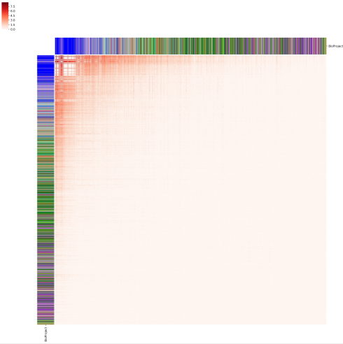
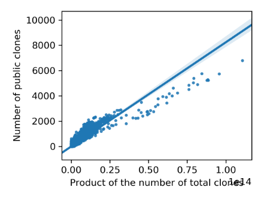

# Resource

## Overview
This repository contains all scripts and preliminary statistics related to the key analyses in each section in Result of manuscript (MS) ***"Large-scale analysis of 2,152 Ig-seq datasets reveals key features of B cell biology and the antibody repertoire"***. These analyses can be classified into four categories, including gene usage, somatic recombination, somatic hypermutation and public clones. More details can be found in the following sections.

## Gene usage


## Somatic recombination


## Somatic hypermutation


## Public clone
### Preliminary statistics
* [PUB_all_to_all_repertoire_comparison_matrix.csv.gz](data/PUB_all_to_all_repertoire_comparison_matrix.csv.gz) 
	- The 2152*2152 matrix recording all-to-all repertoire comparisons (Fig. 5A in MS)
* [PUB_pairwise_repertoire_comparison.tab.gz](data/PUB_pairwise_repertoire_comparison.tab.gz) 
	- The table recording pairwise repertoire comparison together with the number of total clones for compared samples (Fig. 5B) 
* [PUB_public_clone_record_from_mixcr_output.tab.gz](data/PUB_public_clone_record_from_mixcr_output.tab.gz) 
	- The file containing all lines in the clones.txt file that records public clones (Fig 5C)
### Scripts
#### All-to-all public clone quantification (Fig. 5A)
`python all2all_public_quantification.py clone_file_path.tab`

The script, `all2all_public_quantification.py`, implements an all-to-all public clone quantification among enrolled samples. It takes only an annotation tabular file, `clone_file_path.tab`, as input. This file has three columns including sample id, project id and path to `clones.txt` that output by MiXCR and it looks like below,
```
Sample	Project	Path
DRR056252	PRJDB4353	DRR056252_MIXCR/clones.txt
DRR056253	PRJDB4353	DRR056253_MIXCR/clones.txt
DRR056254	PRJDB4353	DRR056254_MIXCR/clones.txt
ERR1760498	PRJEB15295	ERR1760498_MIXCR/clones.txt
ERR1812282	PRJEB18926	ERR1812282_MIXCR/clones.txt
ERR1812283	PRJEB18926	ERR1812283_MIXCR/clones.txt
```
It outputs three statistic files, including two all-to-all repertoire comparison matrixes (i. e. `PUB_all_to_all_repertoire_comparison_matrix.csv.gz`) and a tabular file with three columns (clone, shared samples, number of shared samples) which is as below,
```
Clone	Samples	No.of.Samples
IGHV3-7_IGHJ4_TGTGTGAGAAGTCTAGGGATCCACTGG	SRR5063107,SRR5063100	2
IGHV3-64D_IGHJ4_TGTGTGAAAGCTCCTGGTGGCTGGTCCAACCCCTTTGACTACTGG	SRR8365263,SRR8365473	2
IGHV1-69_IGHJ4_TGTGCGAGAGATCGGGAGAACTGGAACTACGTATTTGACTACTGG	SRR8365263,SRR8365261,SRR8365473,SRR8365471	4
IGHV3-30-3_IGHJ4_TGTGCGAGAGGAGATTCCCGATACAGCTATGGCCTAGACCTTGACTACTGG	SRR8365263,SRR8365261	2
```
The two matrixes are different from each other in that one of them neglects clone sharing between samples from the same project while the other does not (see _Method_ in MS above). 

#### All-to-all public clone visualization (Fig. 5A)

`python all2all_public_visualization.py matrix.tab metadata.tab`

The script, `all2all_public_visualization.py`, implements the visualization of all-to-all public clone quantification result. It takes two parameters, the first is the all-to-all repertoire comparison matrix (i. e. `PUB_all_to_all_repertoire_comparison_matrix.csv.gz`) and the second is a tabular metadata for each enrolled sample (i. e. `metadata.tab`). The samples are ordered according to the number of total clones they contain. The output figure looks like



#### Linear model visualization (Fig. 5B)

`python linear_model_visualization.py pairwise_rep_comp.tab`

The script, `linear_model_visualization.py`, implements the visualization of the linear model we observed between repertoires. It takes only the pairwise repertoire comparison tabular file (with the number of total clones for compared samples included, i. e. PUB_pairwise_repertoire_comparison.tab.gz) and gives two kinds of output with one being figures demonstrating the linear models and the other being a tabular file recording the parameters of linear models. The output figures show linear models together with individual points and each of them looks like




#### Quantification and visualization of the correlation between clonality and publicness of public clones (Fig. 5C)

`python clonality_publicness_correlation_visualization.py pub_record.tab metadata.tab`

The script, `clonality_publicness_correlation_visualization.py`, implements the visualization of correlation between clonality and publicness. It takes two parameters, the first is the file containing all lines in the clones.txt file that records public clones (i. e. PUB_public_clone_record_from_mixcr_output.tab.gz) and the second is a tabular metadata for each enrolled sample (i. e. `metadata.tab`). The output figure looks like


## Dependencies
In-house scripts above were written in Python (v3.7) and MATLAB (v). For python, a series of modules are required, which include pandas, csv. For MATLAB, xxx and xxx are required. 

## Others
For the scripts implementing other analyses in the MS, please contact the Lead Contact, Zhenhai Zhang (zhenhaismu@163.com).