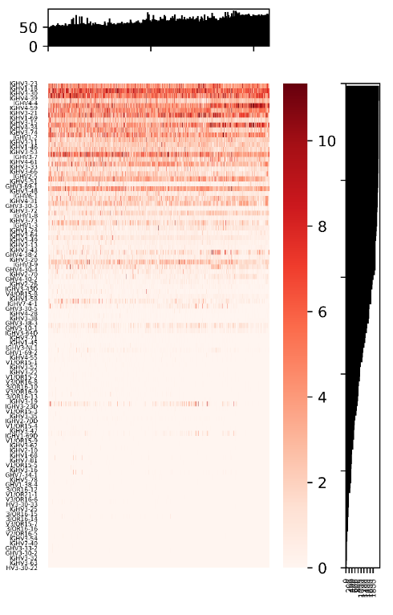
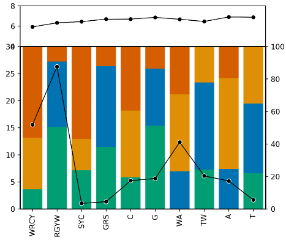

# Resource

## Overview
This repository contains all scripts and preliminary statistics related to the key analyses in each section in the Result of the manuscript (MS) ***"Large-scale analysis of 2,152 Ig-seq datasets reveals key features of B cell biology and the antibody repertoire"***. These analyses can be classified into four categories, including gene usage, somatic recombination, somatic hypermutation and public clones. More details can be found in the following sections.

- [Gene usage](#Gene-usage)
- [Somatic recombination](#Somatic-recombination)
- [Somatic hypermutation](#Somatic-hypermutation)
- [Public clone](#Public-clone)

## Gene usage
#### Gene usage overview quantification (Fig. 2A)

`python geneUsageOverview_quantification.py V_input.txt V outDir`

The script, `geneUsageOverview_quantification.py`, implements the overview of V/D/J gene usage. It takes three parameters including tabular usage matrix file, gene type, and output directory. Each column for the usage matrix file indicates a sample and each row stands for a gene segment. The usage matrix file looks like below,
```
	SRR8365312	ERR2567197	ERR1812302
IGHV3-23	11.36	7.65	12.65
IGHV3-13	0.35	0.63	0.31
IGHV4-34	2.34	3.85	2.48
IGHV3-33	3.57	4.34	3.98
IGHV1-18	4.87	3.38	3.28
```
It outputs four tabular files and columns for each file are explained as below,

`V_gene_sample_num.txt`
- col 1: the name of the gene segment
- col 2: the number of samples having this gene segment

`V_gene_reads_num.txt`
- col 1: the SRR id for each sample
- col 2: the number of productive reads for a sample

`V_gene_num_per_sample.txt`
- col 1: the SRR id for each sample
- col 2: the number of gene segments a sample has

`V_gene_usage.txt` (Samples in this file were sorted by the number of productive reads and genes were sorted by the number of samples having it.)
- each column: the SRR id for each sample
- each row: the name of the gene segment

#### Gene usage overview visualization (Fig. 2A)

`python geneUsageOverview_visualization.py V_gene_usage.txt V_gene_sample_num.txt V_gene_num_per_sample.txt outDir`

The script, `geneUsageOverview_visualization.py`, implements the visualization of overall gene usage. It takes four parameters including three files generated by the script above and one output directory. The output figure looks like, 



#### Core gene selection (Fig. 2B)

`python obtainCoreGene.py V_accu_fraction.txt outDir`

The script, `obtainCoreGene.py`, implements the core V gene selection and visualization. It takes two parameters which include the tabular V gene accumulated usage file and the output directory. The tabular file which looks like below has three columns named `Gene_order`, `Run`, and `Clone_fraction`. This script has two outputs, one figure and one file recording the index to stop enrolling genes and its’ slope. The figure looks like below, 


## Somatic recombination

`python VDrecombination.py VDUnpro.csv Vgene Dgene Vlocal.txt Dlocal.txt Jlocal.txt CoreVgene.txt VDcombination.png`

The script, `VDrecombination.py`, shows the VD recombination relationship between recombination frequency and their genomic location. The input files include the summary of the location, the gene name, the order of V, D, J and the core gene list. The last parameter specifies the output of the script.


`python DJrecombination.py Runlist.txt Jgene Dgene Vlocal.txt Dlocal.txt Jlocal.txt DJrecombination.png indir`

The script, `DJrecombination.py`, shows the DJ recombination relationship between recombination frequency and their genomic location. The parameters are  same as above. `indir` contains the statistics for each sample (e. g. `DRR056252_MIXCR.txt`).


`python DDFusioninCellType.py DDFusion.csv metadata.tab CloneNumber.csv DDfusionisotype.png`

The script, `DDFusioninCellType.py`, shows the frequency of DD fusion in different cell types. The script takes three inputs, including the result of DD fusion for all samples, the metadata, observed clones for all samples, and the output of the script.


`python DDFusionGene.py DDAndCDR3.csv Dlocal.txt DDheatmap.png DDspan.png`

The script, `DDFusionGene.py`, shows D gene combinatorial frequency in all DD fusions and the span of the two D gene in DD fusion. The script takes four parameters as input, including the output of IgScout, the locations of D genes, and the name of two output figures.


## Somatic hypermutation
### Scripts
#### Consensus sequence approach
##### Obtain qualified clones

`python shm_ExtractAvailableCloneData.py alignments.txt clones.txt`

The script, `shm_ExtractAvailableCloneData.py`, implements the selection of qualified clones that meet our criteria specified in the MS. It takes 2 files as input, these files are `alignments.txt` and `clones.txt` from MiXCR. The output are files named after `cloneId` initially assigned by MiXCR.

##### Get consensus sequences

`python shm_GetConsensusSequence.py`

The script, `shm_GetConsensusSequence.py`, implements the determination of consensus sequence from each clone. The input files are all available clone files  output by `shm_ExtractAvailableCloneData.py`, and the output record the alignment information of consensus sequences for each clone.

##### Positional mutation frequency calculation

`python shm_PosMutationAlleleCountMotifVersion.py -i allele.txt -d outdir -r IGHV.reference.fasta`

The script, `shm_PosMutationAlleleCountMotifVersion.py`, implements positional mutation frequency calculation for each allele per sample. It takes 3 parametes as input: `allele.txt` contains consenesus sequences for each allele per sample, such as:`IGHV1-18.01.txt`, `outdir` is the output directory, the default output is current work directory, `IGHV.reference.fasta` contains sequence and region length information for functional alleles. The output files contain allele-wise positional mutation information that are named in a way like `z.mut_type.IGHV1-18.01.txt`.

`python shm_PurifiedPositionAnnotation.py`

The script, `shm_PurifiedPositionAnnotation.py`, implements the annotation of each position in germline sequences according to the classification in the MS (i. e. silent, replacement and composite). The input files contain allele-wise positional mutation information (e. g. `z.mut_type.IGHV1-18.01.txt`). The output files contain loci-type-annotated positional mutation information (e. g. `z.mut_type.IGHV1-18.01.txt.flag`).

##### Motif and nucleotide transition matrix generation

`python shm_CountPurifiedMotifAndNT.py`

The script, `shm_CountPurifiedMotifAndNT.py`, implements the generation of motif and nucleotide transition matrixes. The input files are the outputs of script `shm_PosMutationAlleleCountMotifVersion.py`. The output of motif is as `motif_mut_profile_merged.txt` described below, and the output of nucleotide transition looks like:

```
	A	C	G	T
A	0	0.851806866	3.611710899	0.675947204
C	1.856187662	0	2.811844488	1.427511942
G	3.977638529	1.787416014	0	0.798690939
T	1.983214223	2.239544164	0.809600205	0
```

##### Positional mutation frequency calculation (Fig. 5C)

`python shm_PosMutationAlleleCount.py -i allele.txt -d outdir -r IGHV.reference.fasta`

The script, `shm_PosMutationAlleleCount.py`, implements positional mutation frequency calculation, which likes the script `shm_PosMutationAlleleCountMotifVersion.py`, but the output files (e. g. `z.IGHV1-18.01.pos.mut.txt`) provides calculated mutation frequency per position per allele. The input files are same as the script `shm_PosMutationAlleleCountMotifVersion.py`.

`python shm_CountMutationFreqArray.py -r IGHV.reference.fasta`

The script, `shm_CountMutationFreqArray.py`, implements the generation of positional mutation matrix. The input files are based on the outputs of script `PosMutationAlleleCount.py` and the `IGHV.reference.fasta` described above. The output file, `Fig.5c_d.profile.mut.freq.txt`, looks like:

```
Germline_id	Family	Clone_number	FR1	FR1	FR1	FR1 ...
IGHV1-18.01	IGHV1	7632	0	0	1.95230608	5.896226415 ...
IGHV1-18.02	IGHV1	2	0	0	0	0 ...
IGHV1-18.03	IGHV1	22	0	0	4.545454545	0 ...
IGHV1-18.04	IGHV1	1416	0	0	1.906779661	6.144067797 ...
IGHV1-18.p01	IGHV1	2	0	0	0	0 ...
IGHV1-18.p02	IGHV1	9	0	0	0	44.44444444 ...
IGHV1-18.p03	IGHV1	571	0	0	2.276707531	6.830122592 ...
IGHV1-2.01	IGHV1	2	0	0	0	0 ...
IGHV1-2.02	IGHV1	8140	0	0	1.867321867	1.535626536 ...
...
```

`python shm_CountProfileAnnoFigure.py Fig.5c_d.profile.mut.rate.txt`

The script `shm_CountProfileAnnoFigure.py`, implements the calculation of average mutation frequency per position per gene family. The input file is produced by script `shm_CountMutationFreqArray.py`, and the output file is `Fig.5c_d.profile.mut.avg.freq.txt`, which looks like,
```
Family	0	1	2	3	4	5	6	...
IGHV1	0	0	2.2558699	2.115502799	5.278513178	4.708387966	2.741299932	...
IGHV2	0	0	3.087357819	3.262385197	0.343029214	4.2970153	3.071594905	...
IGHV3	0	0	6.130498167	2.796983631	4.602246122	5.786101052	3.423237516	...
IGHV4	0	0	6.317384036	11.01710885	3.712848775	4.900815076	1.534719161	...
IGHV5	0	0	7.844747882	0.81460539	1.514698427	1.83484034	0.574987494	...
IGHV6	0	0	2.831498797	4.363040991	0.590207914	44.56779895	2.698544206	...
IGHV7	0	0	1.110821822	1.029055673	3.560066769	3.036884423	0.714363587	...
All	0	0	5.101234748	4.73659655	3.949754076	5.329078999	2.588784633	...
```

##### Motif mutation profile visualization

`python shm_PlotMotifFraction.py -i Fig.5b.Purified_Nonsyn.motif.txt -type data_type -d outdir`

The script, `shm_PlotMotifFraction.py`, implements the visualization of motif mutation profile. It takes 3 parameters: `Fig.5b.Purified_Nonsyn.motif.txt`, the format of this file could be referred to the previous section `Motif mutation profile`, the second parameter specifies the category of the loci, such as "Purified_Nonsyn", and the third parameter specifies the output directory. The output looks like:
 


##### Positional mutation frequency visualization

`python shm_PlotProfileHeatmap.py -p Fig.5c_d.profile.mut.rate.txt -a Fig.5c_d.profile.mut.avg.freq.txt -type data_type -d outdir`

The script, `shm_PlotProfileHeatmap.py`, implements the visualization of positional mutation frequency profile. It takes 4 parameters: `positional.mutation.file.txt`, this file can be produced by `shm_CountMutationFreqArray.py`, the second parameter `average.mutation.file.txt`, this file can be produced by `shm_CountProfileAnnoFigure.py`, the third parameter specifies datasets such as "IGHG.F", the last parameter specifies the output directory. The output looks like:


#### Position weight matrix approach

##### Sample-wise positional and regional mutation frequency quantification

`python shm_positional_mut_freq_for_each_sample.py sample alignments.txt clones.txt isotype outdir`

The script, `positional_mut_freq_for_each_sample.py`, implements the positional mutation frequency calculation for alleles in each sample. It takes five parameters as input, which include the sample id (`sample`), the path to `alignments.txt` and `clones.txt` output by MiXCR for each sample, the isotype (i. e. "IGHG") included for analysis, and the output directory. It outputs a directory structure as below.

```
- outdir
	- productive
		- sample1-IGHG
			- IGHV1-18.01.pos.mut.type.stat
			- IGHV1-18.04.pos.mut.type.stat
			...
			- IGHV7-4-1.02.pos.mut.type.stat
		- sample1-IGHA
		...
		- sample2-IGHG
	- unproductive
	...
```
Under the tertiary directory, (e. g. `sample-IGHG`) are output files recording positional mutation information for distinct alleles, each of which looks like,
```
pos	ref	A	T	C	G	is_synA	is_synT	is_synC	is_synG	nReads
0	C	0.000	0.000	0.000	0.000	No	No	Yes	No	327
1	A	0.000	0.000	0.000	0.000	Yes	No	No	No	327
2	G	0.000	1.083	0.583	0.000	Yes	No	No	Yes	327
...
284	C	0.000	1.000	0.000	0.000	No	Yes	Yes	No	327
```

`python shm_regional_mut_freq_for_each_sample.py sample alignment.txt clones.txt`

The script, `shm_regional_mut_freq_for_each_sample.py`, implements regional mutation frequency for each sample. It takes three parameters as input, which include the sample id (`sample`), the path to `alignments.txt` and `clones.txt` output by MiXCR for each sample. Its output is a file named as `sample_mut_freq_stat.txt`, which records the mutation frequencies for different regions for each clone. The output looks like,
```
cloneId	vAllele	isotype	productivity	allMutRate	fr1MutRate	cdr1MutRate	fr2MutRate	cdr2MutRate	fr3MutRate	nAvaiReads
0	IGHV4-39*07	IGHG2*00	productive	0.10590277777777778	0.06266666666666666	0.19333333333333333	0.06274509803921569	0.2857142857142857 0.0972972972972973	10
1	IGHV4-39*07	IGHG2*00	productive	0.08543836805555556	0.044583333333333336	0.16458333333333333	0.08075980392156863	0.1529761904761905 0.08102477477477478	160
2	IGHV1-24*01	IGHGP*00	productive	0.11594202898550725	0.07173913043478261	0.17844202898550723	0.12489343563512362	0.137228260869565220.1235801018409714	92
3	IGHV4-39*07	IGHG1*00	productive	0.06253858024691358	0.03155555555555556	0.07148148148148148	0.04183006535947712	0.108465608465608460.08188188188188188	90
```

##### Positional mutation profile based on multiple samples

`python shm_positional_mut_freq_profile.py allelelist indir`

The scripts, `shm_positional_mut_freq_profile.py`, implements the generation of positional mutation frequency profile. It takes two parameters as input, which include a file recording the list of alleles (e. g. `functional.allele.id.list.txt`) included for analysis and the directory containing positional mutation information for alleles for each sample (i. e. `outdir/productive` output by script `shm_positional_mut_freq_for_each_sample.py`). It outputs three files, 
- `allele_sample_clone_number.txt`  # the file recording the number of samples and clones associated with an allele
- `positional_mut_freq_matrix.txt`  # the positional mutation frequency matrix with each row being an allele and each column being a position
- `region_length_for_matrix_anno.txt`  # the file recording the length of each region in the matrix above

##### Regional mutation comparison and correlation with age

`python shm_regional_mut_freq_trans_anno.py sample statfl outdir`

The scripts, `shm_regional_mut_freq_trans_anno.py`, implements the format transformation and annotation of regional mutation frequency statistics (i. e. `sample_mut_freq_stat.txt`) for each sample. The transformation simplifies the visualization process. It takes three parameters as input, which include the sample id (`sample`), the preliminary regional mutation frequency statistics file (`sample_mut_freq_stat.txt`), and the output direcotry. Its output is a transformed and annotated regional mutation frequency statistics file (`sample_mut_freq_trans_anno.txt`). 

Here we utilized shell commandline to combine statistics files of multiple samples.

`cat outdir/* | awk '!($0~/cloneId/ && NR!=1)' >mut_freq_trans_anno_comb.txt`

Note that `outdir` here refer to the output directory specified for script `regional_mut_freq_trans_anno.py`.

`python shm_mut_freq_cmp_bwt_age_group.py mut_comb_fl`
The script, `mut_freq_cmp_bwt_age_group.py`, implements the visualization of comparison of regional mutation frequency between different age groups. It takes only the combined regional mutation frequency statistics files as input (i. e. `mut_freq_trans_anno_comb.txt`). The output looks like,


`python shm_mut_freq_age_corr.py mut_comb_fl`
The script, `shm_mut_freq_age_corr.py`, implements the analysis of the correlation between overall mutation frequency (from FR1 to FR3) and age. It takes only the combined regional mutation frequency statistics files as input (i. e. `mut_freq_trans_anno_comb.txt`). Its outputs include a figure demonstrating the correlation and a file recording the linear model parameters. The figure looks like,


The file recording linear model parameters looks like,
```
isotype	gender	coef	intercept	R-squared
IGHA	Female	0.0003539150426987656	0.06528877132748681	0.0433362868691467
IGHA	Male	0.0011655075044146098	0.04149377931949247	0.2966713591064206
IGHD	Female	0.0005268099127560729	0.0005754457476520349	0.00993267480203841
IGHD	Male	-0.00014748343401274752	0.022942479708302866	0.005795231577692572
IGHE	Male	-0.013897958621196298	0.5243554461429831	0.4658613277026857
IGHE	Female	0.0	0.06745411347817634	0.0
IGHG	Female	0.0004939193126108091	0.07200756953459697	0.2815953504945391
IGHG	Male	0.0006523811359994215	0.06172890824735465	0.3716504319109728
IGHM	Female	-0.0020613457777915816	0.08815766925102467	0.06996061254096253
IGHM	Male	-0.0003308329053527781	0.0385303883641472	0.02563625588898499
```

##### Nucleotide conversion

`python shm_nt_conversion_stat.py sampleid_file isotype indir outdir`

The script, `shm_nt_conversion_stat.py`, implements the analysis of the nucleotide conversion and generate for each sample a nucleotide conversion matrix. It takes four parameters as input, which include a sample list file (`sampleid_file`), the isotype (i. e. "G", means "IGHG"), the directory containing positional mutation information for alleles for each sample (i. e. `outdir/productive`) and the output directory. Its outputs a file recording the nucleotide conversion statistics and a heatmap visualizaing the statistics. The figure looks like,


##### Motif mutation profile (Fig. 5A)

`python shm_motif_mut_freq_cal_for_single_sample.py sample alignments.txt clones.txt`

The script, `shm_motif_mut_freq_cal_for_single_sample.py`, implements motif mutation profile quantification for each sample. It takes three parameters as input, which include the sample id, `sample`, and the path to `alignments.txt` and `clones.txt` output by MiXCR for each sample. Noted that a column `cloneId` is required in `alignments.txt` for determining the relationship between reads and clones. This script outputs for each sample a file named `*_motif_stat.txt` that records the germline count for each motif and the count for each mutunt nucleotide.

`python shm_motif_mut_freq_merge_for_multiple_samples.py pathfile`

The script, `shm_motif_mut_freq_merge_for_multiple_samples.py`, implements the merge of individual statistical files output by `shm_motif_mut_freq_cal_for_single_sample.py`. It takes only a file that records the paths to all individual file as input and output a merged statistical file named `motif_mut_profile_merged.txt`, which looks like

```
Motif	Percentage	Mutated_num	Germline_num	A	C	G	T	A_mut	C_mut	G_mut	T_mut
WRCY	0.0	0.0	0.0	0.0	0.0	0.0	0.0	0.0	0.0	0.0	0.0
RGYW	20.1	55307.52	275123.0	54.05	33.76	0.0	12.19	29892.46	18671.34	0.0	6743.72
SYC	3.0	46490.89	1548139.0	23.76	0.0	37.57	38.66	11048.41	0.0	17468.41	17974.08
GRS	4.02	47448.62	1178900.0	42.32	39.0	0.0	18.69	20078.4	18503.5	0.0	8866.72
C	5.57	140912.61	2527879.0	22.37	0.0	28.84	48.79	31526.0	0.0	40641.47	68745.14
G	10.21	261286.94	2559167.0	45.06	31.78	0.0	23.16	117741.83	83040.56	0.0	60504.55
WA	24.94	38831.51	155687.0	0.0	21.86	48.09	30.04	0.0	8490.01	18675.62	11665.88
TW	15.28	81991.92	536617.0	25.14	53.32	21.53	0.0	20614.11	43721.07	17656.75	0.0
A	8.08	147746.78	1828092.0	0.0	34.17	44.32	21.51	0.0	50478.65	65481.58	31786.55
T	6.54	98286.75	1502607.0	17.56	38.15	44.28	0.0	17261.95	37498.82	43525.98	0.0
```


## Public clone
### Preliminary statistics
* [PUB_all_to_all_repertoire_comparison_matrix.csv.gz](data/PUB_all_to_all_repertoire_comparison_matrix.csv.gz) 
	- The 2152*2152 matrix recording all-to-all repertoire comparisons (Fig. 4A in MS)
* [PUB_pairwise_repertoire_comparison.tab.gz](data/PUB_pairwise_repertoire_comparison.tab.gz) 
	- The table recording pairwise repertoire comparison together with the number of total clones for compared samples (Fig. 4B) 
* [PUB_public_clone_record_from_mixcr_output.tab.gz](data/PUB_public_clone_record_from_mixcr_output.tab.gz) 
	- The file containing all lines in the clones.txt file that records public clones (Fig. 4C)
### Scripts
#### All-to-all public clone quantification (Fig. 4A)

`python all2all_public_quantification.py clone_file_path.tab`

The script, `all2all_public_quantification.py`, implements an all-to-all public clone quantification among enrolled samples. It takes only an annotation tabular file, `clone_file_path.tab`, as input. This file has three columns including sample id, project id and path to `clones.txt` that output by MiXCR and it looks like below,
```
Sample	Project	Path
DRR056252	PRJDB4353	DRR056252_MIXCR/clones.txt
DRR056253	PRJDB4353	DRR056253_MIXCR/clones.txt
DRR056254	PRJDB4353	DRR056254_MIXCR/clones.txt
ERR1760498	PRJEB15295	ERR1760498_MIXCR/clones.txt
ERR1812282	PRJEB18926	ERR1812282_MIXCR/clones.txt
ERR1812283	PRJEB18926	ERR1812283_MIXCR/clones.txt
```
It outputs three statistic files, including two all-to-all repertoire comparison matrixes (i. e. `PUB_all_to_all_repertoire_comparison_matrix.csv.gz`) and a tabular file with three columns (clone, shared samples, number of shared samples) which is as below,
```
Clone	Samples	No.of.Samples
IGHV3-7_IGHJ4_TGTGTGAGAAGTCTAGGGATCCACTGG	SRR5063107,SRR5063100	2
IGHV3-64D_IGHJ4_TGTGTGAAAGCTCCTGGTGGCTGGTCCAACCCCTTTGACTACTGG	SRR8365263,SRR8365473	2
IGHV1-69_IGHJ4_TGTGCGAGAGATCGGGAGAACTGGAACTACGTATTTGACTACTGG	SRR8365263,SRR8365261,SRR8365473,SRR8365471	4
IGHV3-30-3_IGHJ4_TGTGCGAGAGGAGATTCCCGATACAGCTATGGCCTAGACCTTGACTACTGG	SRR8365263,SRR8365261	2
```
The two matrixes are different from each other in that one of them neglects clone sharing between samples from the same project while the other does not (see _Method_ in MS above). 

#### All-to-all public clone visualization (Fig. 4A)

`python all2all_public_visualization.py matrix.tab metadata.tab`

The script, `all2all_public_visualization.py`, implements the visualization of all-to-all public clone quantification result. It takes two parameters, the first is the all-to-all repertoire comparison matrix (i. e. `PUB_all_to_all_repertoire_comparison_matrix.csv.gz`) and the second is a tabular metadata for each enrolled sample (i. e. `metadata.tab`). The samples are ordered according to the number of total clones they contain. The output figure looks like


#### Linear model visualization (Fig. 4B)

`python linear_model_visualization.py pairwise_rep_comp.tab`

The script, `linear_model_visualization.py`, implements the visualization of the linear model we observed between repertoires. It takes only the pairwise repertoire comparison tabular file (with the number of total clones for compared samples included, i. e. `PUB_pairwise_repertoire_comparison.tab.gz`) and gives two kinds of output with one being figures demonstrating the linear models and the other being a tabular file recording the parameters of linear models. The output figures show linear models together with individual points and each of them looks like


This tabular file, `linear_model_params.txt`, consists of four columns, including `CloneNumFilter` (clone number filter criteria), `Coef` (coefficient of the linear model), `Intercept` (intercept of the linear model) and `R2` (goodness of fit), which looks like
```
CloneNumFilter  Coef    Intercept       R2
10000   8.235715861523267e-11   3.018497992946571       0.8657346352020397
100000  8.06189835673996e-11    21.389248342230502      0.87066669432678
1000000 6.195753424951246e-11   382.57448702253726      0.8547479623611061
2000000 5.83398705048679e-11    494.30328497267794      0.8604386804475349
3000000 5.086226482846224e-11   907.385414449705        0.9609951642782198
4000000 4.9542897429104056e-11  1076.0557291797643      0.982150157073821
5000000 6.876732151569549e-11   -824.2036315063278      0.9974067292062271
```


#### Quantification and visualization of the correlation between clonality and publicness of public clones (Fig. 4C)

`python clonality_publicness_correlation_visualization.py pub_record.tab metadata.tab`

The script, `clonality_publicness_correlation_visualization.py`, implements the visualization of correlation between clonality and publicness. It takes two parameters, the first is the file containing all lines in the clones.txt file that records public clones (i. e. `PUB_public_clone_record_from_mixcr_output.tab.gz`) and the second is a tabular metadata for each enrolled sample (i. e. `metadata.tab`). The output figure looks like


## Dependencies
In-house scripts above were written in Python (v3.7) and MATLAB (v). For python, a series of modules are required, which include pandas, csv. For MATLAB, xxx and xxx are required. 

## Others
For the scripts implementing other analyses in the MS, please contact the Lead Contact, Zhenhai Zhang (zhenhaismu@163.com).